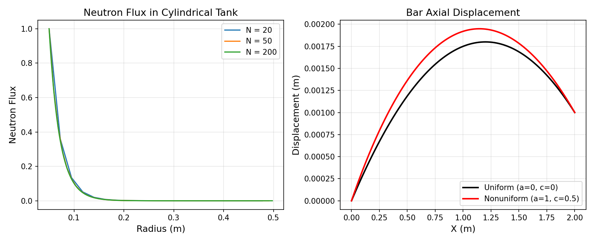

# Finite Differences

Two finite-difference solvers for 1D boundary value problems.

## Problem 1: Neutron Flux in a Cylindrical Tank

Solves the steady-state neutron diffusion equation in cylindrical coordinates for a radiative source (r = 0.05 m) surrounded by water, out to a variable tank radius:

```
-1/r d/dr(r D dphi/dr) + Sigma_a * phi = 0
```

with phi = 1 at the source surface and phi = 0 at the outer boundary (vacuum). The discretization uses conservative finite differences that preserve the 1/r weighting at interface midpoints.

## Problem 2: Axial Displacement of a Bar

Solves for the displacement of a bar with spatially varying elastic modulus E(x) = E0 * sqrt(1 + a*x) and body force g(x) = g0 * (1 + c*x), using centered second-order finite differences. Boundary conditions are zero displacement at x = 0 and a prescribed displacement at x = L.

Coefficients a and c can be passed as command-line arguments (default to 0 for uniform properties).



## Usage

```bash
python Finite_Differences.py
```

The neutron flux solver is called as a function (`finite_diff(nsys, trad)`). The bar displacement solver runs interactively, prompting for the number of segments and the right-end displacement.

## Dependencies

numpy, matplotlib
