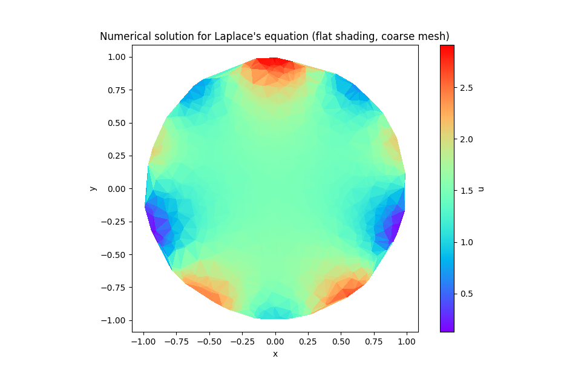

# Finite Element Method

Solves Laplace's equation on a unit disk using linear triangular finite elements.

## Method

1. **Mesh generation** -- 1000 random points are scattered uniformly inside the unit disk, then Delaunay-triangulated via SciPy
2. **Stiffness matrix assembly** -- For each triangle, the local 3x3 stiffness matrix is computed from the barycentric gradient coefficients and assembled into a global sparse matrix (COO -> CSR)
3. **Boundary conditions** -- Nodes at r ~ 1 are identified and assigned Dirichlet values from f(theta) = 3/2 - cos(2*theta)/2 + sin(5*theta)
4. **Solve** -- The modified sparse system is solved with `scipy.sparse.linalg.spsolve`

## Output

A `tripcolor` plot showing the solution field over the disk with flat shading per triangle.



## Usage

```bash
python FEM_Laplace_Disk.py
```

## Dependencies

numpy, scipy, matplotlib
