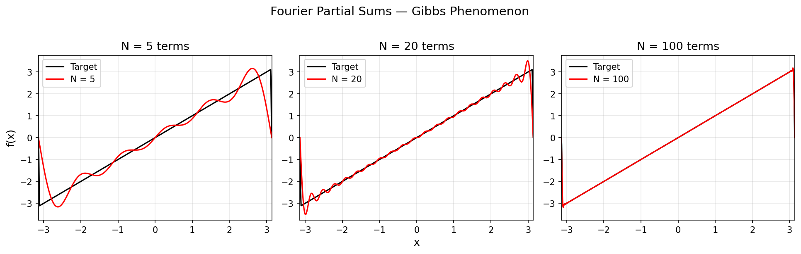

# Fourier Series & Gibbs Analysis

Interactive matplotlib animation showing Fourier partial-sum convergence on a modified sawtooth function with tunable discontinuity sharpness.

## Method

The target function is a piecewise-defined sawtooth on [-pi, pi] with cubic polynomial transitions at the endpoints. The transition width is controlled by a parameter delta, adjustable via a slider. As delta shrinks toward zero the function approaches a pure sawtooth (a jump discontinuity), and the Gibbs overshoot becomes visible in the Fourier approximation.

Fourier coefficients (a0, an, bn) are computed numerically via the trapezoidal rule over 2000 quadrature points, and partial sums are animated up to N = 200 terms.



## Usage

```bash
python Fourier_Series_Gibbs_Analysis.py
```

A matplotlib window opens with the animation and a delta slider at the bottom. Drag the slider to sharpen or smooth the discontinuity and watch how the Fourier approximation responds.

## Dependencies

numpy, matplotlib
