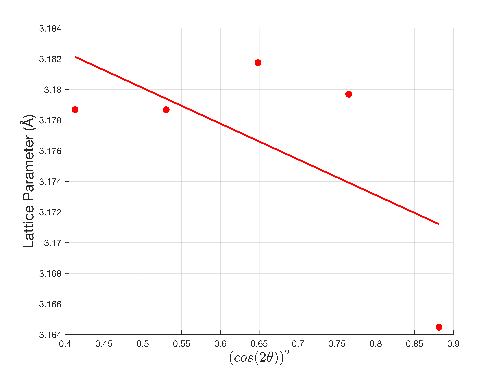

# X-Ray Diffraction

MATLAB analysis of an X-ray diffraction (XRD) pattern for tungsten (W), including lattice parameter determination and error quantification.

## Method

1. **Peak detection** -- Identifies diffraction peaks in the measured 2-theta intensity data using `findpeaks` with a prominence threshold
2. **Miller indices** -- Labels peaks with their (hkl) planes: (110), (200), (211), (220), (310), (222), (123)
3. **d-spacing** -- Computes interplanar spacing via Bragg's law: d = lambda / (2 sin(theta)), using Cu K-alpha radiation (lambda = 1.5406 A)
4. **Lattice parameter** -- Calculates a0 = d * sqrt(h^2 + k^2 + l^2) for each peak, then extrapolates to cos^2(theta) = 0 via linear regression for the best estimate (published value for W: 3.165 A)
5. **Error analysis**:
   - **Sample height displacement** -- Quantifies the angular shift from the sample surface being slightly above/below the diffractometer center (estimated s = -0.29 mm)
   - **X-ray absorption** -- Estimates the transparency-induced angular shift from finite X-ray penetration depth (mu = 3216.54 cm^-1 for W at 8 keV)

## Output

- `W_pattern_a0s.png` -- Lattice parameter vs cos^2(theta) with linear fit
- `peaks.csv` -- Table of peak positions, intensities, d-spacings, lattice parameters, and error terms



## Usage

Run in MATLAB:
```matlab
W_matlab
```

Requires the raw diffraction data file at `out_path/W.txt`.

## Dependencies

MATLAB (Signal Processing Toolbox for `findpeaks`)
